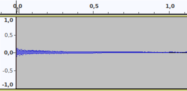
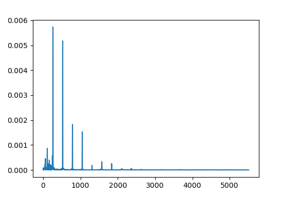
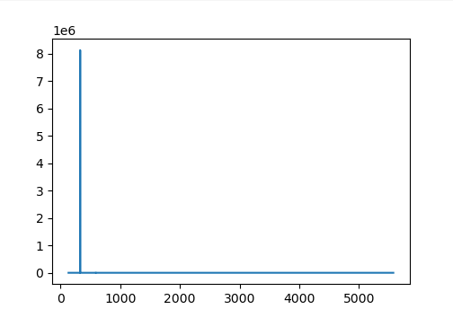
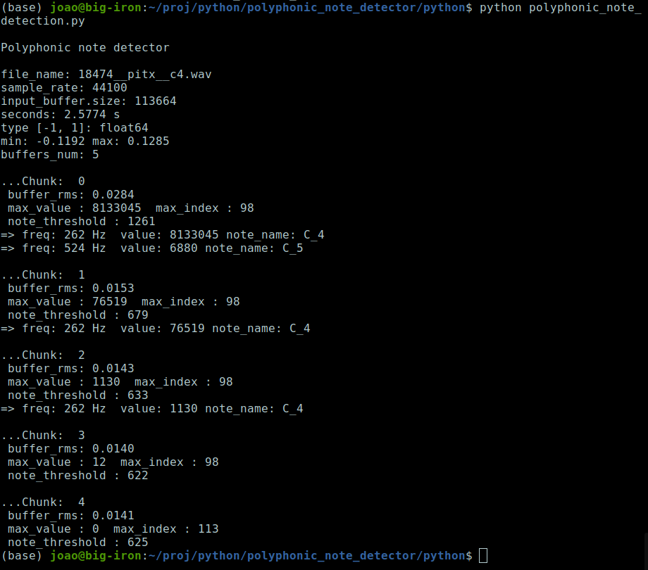
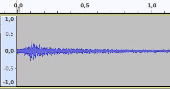
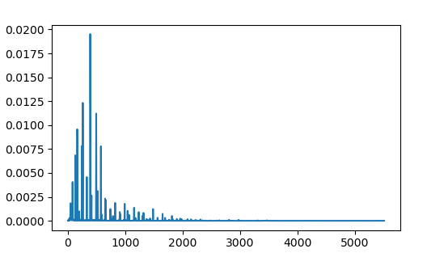
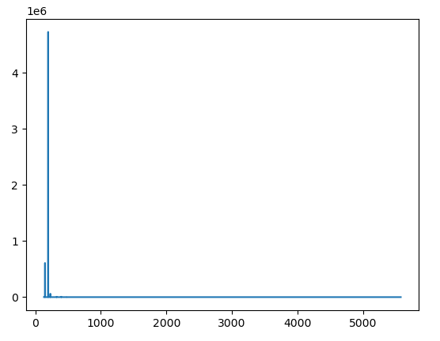
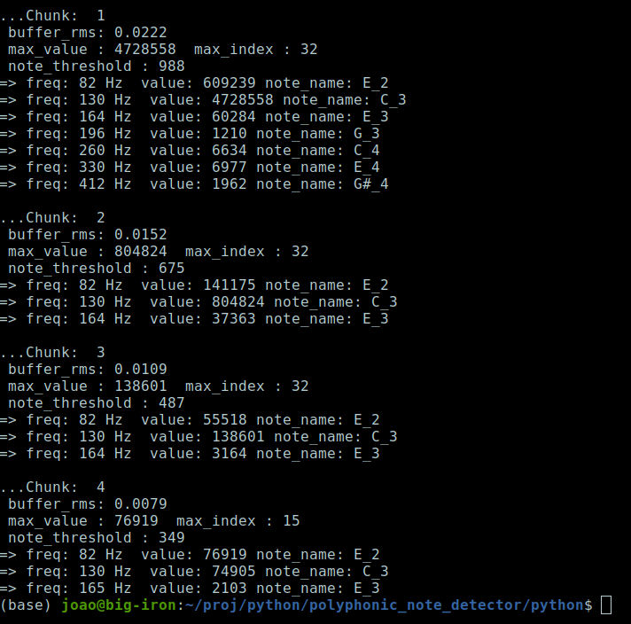

# Polyphonic note detector using Harmonic Product Spectrum
A cool DSP music project made in Python.

## Description
This is my implementation of a polyphonic note detector using the Harmonic Product Spectrum method. The input is a mono WAV file. The output are the corresponding notes for the FFT buffer chunk in time.  
The idea of implementing this project, came when I sow that a group of graduate college students had implemented something similar in hardware (see references) and it appear to me, as a cool method to play with and learn from. Because I didn’t found any complete project that implemented it in a simple way, I only found code for the Harmonic Product Spectrum algorithm for a single note, I decided to do this program and to share my implementation in this repository in GitHub. So that, others can learn with it and play with it. Monophonic note detection is simple, but polyphonic is a little bit harder to do, and is currently still a subject of research, so this code should be viewed as a starting point on this path, but in no way a ending point.

## How it works
This method is very simple. The code works in the following steps:  

1. It starts by calculating the frequencies and the names of all musical notes from C2 to B6 that can works with the ranges of the piano and the guitar. ex: A4 C4 C#4.
 
2. Load’s a WAV file, mono 16 bits, of a note or a chord being played (but can be music) and put it’s data in an array. Then convert’s it from int_16 to  floats data type, in the range -1 e 1.

3. Splits the buffer with the audio data, into sequential buffers of a specific size for the FFT, ex: 2048 samples or 22050 samples each, and process each chunk at a time.

4. For each buffer chunk do:

    1. Apply a Hamming window to the buffer, to minimize the non-linearity of the abrupt starting and ending of the buffer.

    2. Applies the FFT (Fast Fourier Transform) and calculates the central frequency of each FFT bucket / bin.

    3. Removes the DC component from the result of the FFT, set’s the first 3 bins to zero.

    4. Calculates the RMS (Root Mean Square) of the signal in each chunk buffer, so that it can calculate a factor to scale dynamically the final note threshold to apply in the step 4.6.
 
    5. Apply the algorithm of Harmonic Product Spectrum (see references). The implementation that I used come from the book site Audio Content Analysis (see references and the code). Them I modified it so that it could detect polyphonic notes, printed graphs and other things to suit my case. The algorithm Harmonic Product Spectrum, works by making a down-sampling of multiples of fundamental frequencies of musical notes of the spectrum obtained by the FFT and then multiply them. This will align the bins that are harmonics of the fundamental frequency (the ones that the frequency are integer multiples of the fundamental) and then when multiplied will create a new spectrum that has huge picks in the fundamental notes and zero in all other regions of the spectrum. (see references)

    6. Then it does the musical note detection over the spectrum by applying a dynamic threshold that depends on a scale factor parameterized by the previously calculated RMS (Root Mean Square) of each specific chunk.

    7. For each fundamental frequency, finds the nearest musical note name and writes it on the screen for each buffer chunk.

Basically this is how it works :-D  
 
In the code, you also can uncomment code to display graphics of the FFT spectrum, to display graphics of the result of applying the Harmonic Product Spectrum and to prints several important data.

## Images

### C one single note WAV

The waveform  
 

  
 
The FFT Spectrum  
 

  
 
The Harmonic Product Spectrum  
 

  
 
The program output for each buffer chunk in sequence  
 

  

### C major chord notes WAV - Classical guitar E2 C3 E3 G3 C4 E4

The waveform  
 

  
 
The FFT Spectrum  
 

  
 
The Harmonic Product Spectrum  
 

  
 
The program output for each buffer chunk in sequence - **C major chord** classical guitar notes **E2 C3 E3 G3 C4 E4**  
 

  

## References

1. Video - Colin Smith - PAMC Final Presentation  
   At  5 minutes, at 22:15 Note Detector, at 25 minutes Note Detection Challenges, at 30 minutes Testing  
   [https://www.youtube.com/watch?v=hkRn3qBBkzI](https://www.youtube.com/watch?v=hkRn3qBBkzI)

2. Video - Cobb Peterson - Pitch Detection using the Harmonic Product Spectrum Method  
   [https://www.youtube.com/watch?v=e_E3Yiyf01k](https://www.youtube.com/watch?v=e_E3Yiyf01k)

3. Explanation of Harmonic Product Spectrum - CNX  
   [https://cnx.org/contents/i5AAkZCP@2/Pitch-Detection-Algorithms](https://cnx.org/contents/i5AAkZCP@2/Pitch-Detection-Algorithms)

4. Explanation of Harmonic Product Spectrum (HPS) – Web Book  
   [http://musicweb.ucsd.edu/~trsmyth/analysis/Harmonic_Product_Spectrum.html](http://musicweb.ucsd.edu/~trsmyth/analysis/Harmonic_Product_Spectrum.html) 

5. Site of the book Audio Content Analysis – With Python open source code for the Algorithm Harmonic Product Spectrum, that I modified and used  
   [https://www.audiocontentanalysis.org/code/pitch-tracking/hps-2/](https://www.audiocontentanalysis.org/code/pitch-tracking/hps-2/)

6. Anna Wszeborowska - Processing music on the fly with Python  
   [https://www.youtube.com/watch?v=at2NppqIZok](https://www.youtube.com/watch?v=at2NppqIZok)

7. Samples from me and from freesound.org  
   See descriptive file in audio directory.  
   [https://freesound.org/](https://freesound.org/)

## License
MIT Open Source License

## Have fun!
Best regards,  
João Nuno Carvalho 